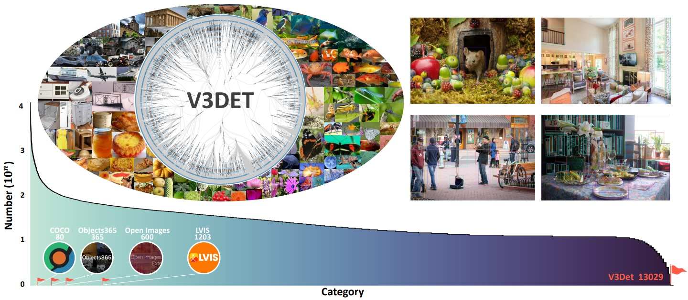

#  V3Det: Vast Vocabulary Visual Detection Dataset

> V3Det: Vast Vocabulary Visual Detection Dataset (ICCV 2023) [[Paper](https://arxiv.org/pdf/2304.03752.pdf), [Dataset](https://v3det.openxlab.org.cn/)]   
> [Jiaqi Wang](https://myownskyw7.github.io/), [Pan Zhang](https://panzhang0212.github.io/), Tao Chu, Yuhang Cao, Yujie Zhou, [Tong Wu](https://wutong16.github.io/), Bin Wang, Conghui He, [Dahua Lin](http://dahua.site/)    

<p align="left">
    
</p>

## Codebase
- [x] mmdetection: https://github.com/V3Det/mmdetection-V3Det
- [ ] Detectron2

## Citation

```bibtex
@article{wang2023v3det,
  title={V3det: Vast vocabulary visual detection dataset},
  author={Wang, Jiaqi and Zhang, Pan and Chu, Tao and Cao, Yuhang and Zhou, Yujie and Wu, Tong and Wang, Bin and He, Conghui and Lin, Dahua},
  journal={arXiv preprint arXiv:2304.03752},
  year={2023}
}
```
